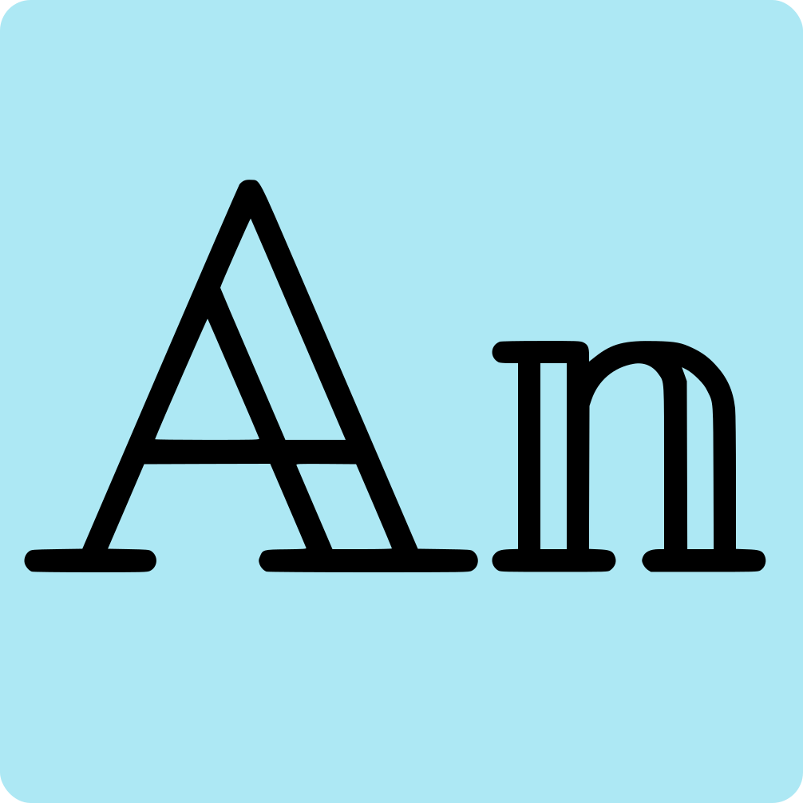

# An (Aarab Nishchal)'s portfolio website

<kbd>My space on web</kbd> to showcase my work, skills, and contact information. The design predominantly uses shades of purple, slate, gray, and slate from Tailwind CSS.

<!-- Logo -->
<p align="center">
  
</p>

<!-- Title -->
<h1 align="center">Aarab Nishchal's Portfolio</h1>

<p align="center">
  <a href="https://vercel.com/aarab-nishchals-projects/an" target="_blank">
    
  </a>
  <a href="https://opensource.org/license/mit" target="_blank">
    
  </a>
</p>

<!-- Table of Contents -->

## Table of Contents

- [Project Overview](#project-overview)
- [Features](#features)
- [Project Structure](#project-structure)
- [How to Run Locally](#how-to-run-locally)
- [Customization](#customization)
- [Color Scheme](#color-scheme)
- [Resources](#resources)
- [Socials](#socials)
- [TODOs](#todos)

## Project Overview

This is a portfolio website built with Next.js 14, Framer Motion, and Tailwind CSS. It showcases my work, skills, and contact information. The design predominantly uses shades of purple, slate, gray, and slate from Tailwind CSS.

**Live Demo:** [https://aarab.vercel.app](https://aarab.vercel.app)

**GitHub Repository:** [https://github.com/losier/an](https://github.com/losier/an)

## Features

- Dynamic and customizable content
- Smooth animations with Framer Motion
- Responsive design
- Custom error and 404 pages
- Easy setup for archiving emails using EmailJS
- SEO optimized with meta tags, `robots.txt`, `sitemap.xml`, `humans.txt`, and `security.txt`

## Project Structure

```plaintext
├── public
│   ├── .well-known
│   │   └── security.txt
│   ├── logo.svg
│   ├── humans.txt
│   ├── robots.txt
│   └── sitemap.xml
├── src
│   ├── app
│   │   ├── error.tsx
│   │   ├── global.css
│   │   ├── layout.tsx
│   │   └── not-found.tsx
│   │   └── page.tsx
│   ├── components
│   │   ├── common
│   │   │   ├── ContactForm.tsx
│   │   │   ├── ContactList.tsx
│   │   │   ├── ContactSocialList.tsx
│   │   │   ├── NavIcons.tsx
│   │   │   ├── SkillCard.tsx
│   │   │   └── TechClip.tsx
│   │   │   └── Title.tsx
│   │   └── About.tsx
│   │   └── Contact.tsx
│   │   └── Experience.tsx
│   │   └── Hero.tsx
│   │   └── Navbar.tsx
│   │   └── Projects.tsx
│   │   └── Skills.tsx
│   ├── assets
│   │   ├── logo
|   |   ├── (...4logo).png
│   │   └── fonts
│   │   |   └── argine.otf
│   │   |   └── nasalization.otf
│   │   |   └── Manrope.ttf
│   │   └── pic
│   │   |   └── aboutPic.png
│   │   |   └── bg_Ss.png
│   │   |   └── notFound.svg
│   └── constants
│   |   ├── details.json
│   |   ├── exp.ts
│   |   ├── skills.ts
│   |   └── projects.ts
|   └── Layout
|   |   └── Main.tsx
|   |   └── PreLoader.tsx
├── .env.example
├── .eslintrc.json
├── .gitignore
├── LICENSE.txt
├── next.config.mjs
├── package.json
├── postcss.config.mjs
├── sitemap.config.js
├── tailwind.config.js
├── tsconfig.json
└── README.md
```

## How to Run Locally

1. **Clone the repository:**
   ```bash
   git clone https://github.com/losier/an.git
   ```
2. **Go to the project directory:**
   ```bash
   cd an
   ```
3. **Install dependencies:**
   ```bash
    npm install
   ```
4. **Create a `.env.local` file in the root directory take the values from `.env.example`:**
   ```bash
   cp .env.example .env.local
   ```
5. **Run the development server:**
   ```bash
    npm run dev
   ```
6. **Open [http://localhost:3000](http://localhost:3000) to view it in the browser.**

## Customization

You can easily make this project your own by editing the following files:

- `src/constants/details.json`: Update personal details and social links.
- `public/logo.svg` and `src/assets/logos/[4logo].png`: Replace with your own logos.
- `src/assets/pic/aboutPic.png`: Replace with your own Pic.
- `src/constants/exp.ts`, `src/constants/skills.ts`, and `src/constants/projects.ts`: Update your skills, work experience adn project.
- `src/assets`: Add your own images and fonts if you want.

## Color Scheme

The project uses the following color scheme from Tailwind CSS:

- **Purple Shades**
- **slate**
- **Gray**
- **Slate**

## Resources

- **Next.js**: [https://nextjs.org/](https://nextjs.org/)
- **Framer Motion**: [https://www.framer.com/motion/](https://www.framer.com/motion/)
- **Tailwind CSS**: [https://tailwindcss.com/](https://tailwindcss.com/)
- **EmailJS**: [https://www.emailjs.com/](https://www.emailjs.com/)
- **Background CSS Generator**: [https://bg.ibelick.com/](https://bg.ibelick.com/)
- **Tailwind Components**: [https://flowbite.com/](https://flowbite.com/)

## Socials

- **Instagram**: [@aarab.ii](https://www.instagram.com/aarab.ii/)
- **LinkedIn**: [Aarab Nishchal](https://www.linkedin.com/in/aarab-nishchal/)
- **GitHub**: [losier](https://www.github.com/losier)
- **Twitter**: [@aarab_ii](https://www.twitter.com/aarab_ii)
- **Facebook**: [zzcwc](https://www.facebook.com/zzcwc)
- **Telegram**: [@aarab_ii](https://t.me/aarab_ii)
- **Snapchat**: [aarab.ii](https://www.snapchat.com/add/aarab.ii)

## TODOs

### Updated TODO (2024-05-22)

- [ ] Add an ideas page
- [ ] Add a resume page
- [ ] Update Readme
- [ ] Fix CSS
